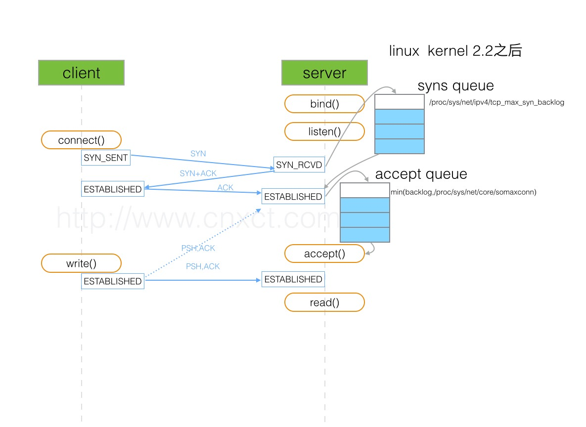
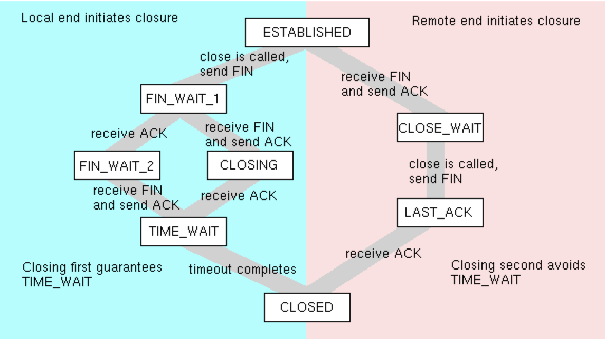

`tcp（Transmission Control Protocol）` 是一种位于传输层、面向字节流、保证可靠传输的全双工协议，作为底层协议，支撑着着应用层如 `http`、`SMTP` 等。鼎鼎大名的 `三次握手`、`四次挥手`指的就是其建立与关闭的流程。

`tcp` 协议的生命周期，本质是一个*有限状态机* 的流转，从建立到数据传输再到关闭，伴随着不同状态的迁移。而在不同的状态中，又会有着一些优化与问题。

`tcp 协议`  本身及其复杂，除了建立与关闭涉及到多次交互外，还需要考虑  `滑动窗口`、`重传策略`、`状态复用`、`拥塞控制`、`RTT（Round Trip Time）` 等等，远古大神们真实费煞苦心。

注：本文的图例来自网络，出处已经不可考，感谢原作者们清晰的图示 :)

# 首部结构

`tcp` 报文首部格式如下：


其中，在日常分析 `tcp` 的建立与关闭时，主要关注的是在 `FLAGS `字段，该字段也即所谓的 `tcp 状态机`，主要有如下字段（大写表示，与序列号区分开）：

* `SYN`：表示建立连接。
* `FIN`：表示关闭连接。
* `ACK`：表示响应。
* `PSH`： `push`，表示当前正在传输数据
* `RST`： `reset`，表示连接重置。

然后，有两个重要的 `32位` 序列号：

* `seq`：`Sequence number`，表示序列号，用来保证数据的有序传输。
  * 如果 `SYN` 设置为 `1`，其表示 `ISN（initial sequence number）`，也即，初始序列号，并期望对方能返回该 `ISN+1`  的 `ack`。
  * 如果 `SYN` 设置为 `0`，表示当前传输报文段中首字节的编号（在当前全部字节流中，通过 `mss` 分段后的编号。

* ack`： `Acknowledgment number (if ACK set)
  * 当且仅当 `ACK` 设置为  `1` 时，才有效。
  *  表示期望收到的下一个 `seq`，如果是 `SYN` 的 `ACK`，其值为发起方的 `ISN+1`。

#  建立

一个连接的建立，大致流程如下，我们使用 `client` 表示主动发起建立方，`server` 表示被动响应建立方：

* `server`  需要 `bind` 某个端口并 `listen`，做好随时迎接一个连接的准备。

* 1、`client` 发送请求建立连接的报文，其中 `SYN = 1` ，`seq`  为一个随机值  `ISN1` ，注意这里必须是随机值而不能设为 `1`，防止被猜测序列号后恶意攻击（也即所谓的「`TCP序列猜测攻击`」）。
  * 此时，`client` 进入 `SYN-SENT` 状态。 
* 2、`server` 收到请求报文后，发送一个 `SYNC =1, ACK = 1`，也即 `SYN+ACK`，且同样的，随机一个  `ISN2` 作为 `seq`，并设 `ack = ISN1+1`，也即对请求报文的确认。其中 `ack` 表示希望 `client` 接下来传该字节开始的数据流。
  * 此时，`server` 进入 `SYN-RECEIVED` 状态。
* 3、`client` 收到响应报文后，需要再次确认，发送一个 `ACK = 1`，并设 `ack = ISN2+1，seq = ISN1+1`，也即表示自己收到了 `server` 的确认报文。这里，`seq = ISN1+1`  是因为，从语义上来说，`server` 希望收到该序号的报文。
  * 自此，双方进入 `ESTABLISHED` 状态，全双工连接建立完成。

需要注意的是，上面的流程中，并没有真正的发送数据，双方只是进行一系列序列号交换的握手操作。

整体示意图如下：



## 为什么是三次握手

为什么是三次握手，而不是不是`2` 次或`4` 次呢？

从建立的流程可以看出，`第一次` 发送，表示 `client` 请求建立连接；第二次表示 `server` 收到了请求并做了回复。这里如果没有第三次就  `ESTABLISHED`  了，开始传输数据，那么会有什么问题呢？

这里，我们需要重点关注 `seq` ，`tcp` 就是依据这个字段进行所谓 `可靠传输` 的，也即，`tcp` 双方都依赖这个序列号来进行数据包的有序传输。

所以，在前两次握手完成后，此时：

* `client` 得到了正确的返回 `ISN1+1`，且得到了 `server` 的 `seq`，也即 `cient` 知道 `server` 已经收到自己的数据包了，且知道 `server` 下一个要发的序列；

* `server` 不确定自己的 `ACK`  是否成功被 `client` 接收，假设这时这个包丢了，  `server`  直接把自己置为  `ESTABLISHED` ，但这个时候 `client` 仍然处于 `SYN-SENT` 状态，全双工的连接并没建立起来！
* 也即，此时，`client`  不知道 `server` 的 `seq`， `server`  就无法保证  `client`   是按照正确的顺序来接收数据包。如果 `server` 继续发送数据，`client` 无法做到有序接收。

为什么不是 `4` 次连接呢，但这里我们已经知道 `3` 次就已经可以建立了，所以，为什么还要多一次呢，浪费资源 。。。

## backlog 是什么

在上面的示意图中，我们可以看到，`server` 端有两个 `qeue`：`syn queue`、`accept queue`，其含义为:

* `syn queue`：半连接队列。当 `server` 第一次收到请求报文后，内核会将该连接放入 `syn queue`，然后发送 `SYN+ACK` 给 `client`。顾名思义，这个队列保存的都是正在建立中的连接列表。
  *  `syn queue`，可构造 `TCP SYN FLOOD` 攻击，发送大量的 `SYN` 报文，然后丢弃，导致 `server` 的该队列一直处于满负荷状态，无法处理其他正常的请求。
  * 当队列已满， `net.ipv4.tcp_syncookies` 会决定内核如何处理
* `accept queue`：全连接队列。。当 `server` 再次收到  `client` 的 `ACK` 后，从 `syn queue` 拿出该连接，这时，如果
  * 队列未满：放入到全连接队列中，系统调用 `accept` 本质就是从该队列不断获取已经连接好的请求。
  * 队列已满：
    * `tcp_abort_on_overflow = 0`：`server` 丢弃该 `ACK`，`client` 表现为  `read timeout` ，`tcp` 超时重传机制，`server` 会再次发送 `SYN+ACK`，也即重复第二次应答。
    * `tcp_abort_on_overflow = 1`：`server` 回复 `RST`，并从半连接队列中删除，`client` 表现为 `connection reset by peer`

这里的逻辑比较复杂，涉及到内核很多参数的设置，具体可以参考相关书籍。

我们回到标题的 `backlog` 上，之所以重点关注这个参数，是因为在日常的 `web 开发` 中，涉及到的 `nginx + redis + php-fpm` 等，配置项大多都有这个参数，而这些软件都是典型的  `server-client` 结构。

`server` 监听函数 `listen` 原型如下（`man listen`），这里第二个参数就是我们要讨论的 `backlog`：

```c
       int listen(int sockfd, int backlog);
```

这个 `backlog` 参数，定义是 *已连接但未进行 `accept` 处理的 `SOCKET` 队列大小*，也即上面提到的 `accept queue`。如果这个队列满了，将会发送一个ECONNREFUSED错误信息给到客户端,即 linux 头文件 /usr/include/asm-generic/errno.h中定义的“Connection refused”，（如果协议不支持重传，该请求会被忽略）如下：

* `nginx`：默认为 `511`

```
backlog=number
sets the backlog parameter in the listen() call that limits the maximum length for the queue of pending connections. By default, backlog is set to -1 on FreeBSD, DragonFly BSD, and macOS, and to 511 on other platforms.
```

* `redis`：默认为 `511`

```
# TCP listen() backlog.
#
# In high requests-per-second environments you need an high backlog in order
# to avoid slow clients connections issues. Note that the Linux kernel
# will silently truncate it to the value of /proc/sys/net/core/somaxconn so
# make sure to raise both the value of somaxconn and tcp_max_syn_backlog
# in order to get the desired effect.
tcp-backlog 511
```

* `php-fpm`：默认为 `511`

```
; Set listen(2) backlog.
; Default Value: 511 (-1 on FreeBSD and OpenBSD)
;listen.backlog = 511
```

所以，我们 *惊奇* 的发现，三者的默认值都为 `511`，但其实之前 `php-fpm` 设置的是 `65535`，后来在某个版本中 `fix` 了，`issue` 参见 [Set FPM_BACKLOG_DEFAULT to 511](https://github.com/php/php-src/commit/ebf4ffc9354f316f19c839a114b26a564033708a)。

那么，为什么要 `fix`


# 关闭

关闭一个 `tcp`  链接的流程图如下（之前留的图，出处已不可考了）：




可通俗解释为：


## 为什么需要四次


## 代码示例


## time_wait 问题


## 优化


* [wikipedia](https://en.wikipedia.org/wiki/Transmission_Control_Protocol)


* 1、主动关闭方，发送 `FIN` 报文（`s`），告诉被动方「我想要关闭这个链接了」，然后主动关闭方进入 `FIN_WAIT_1`  状态；
* 